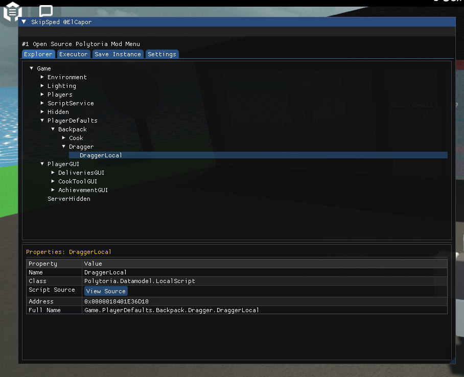
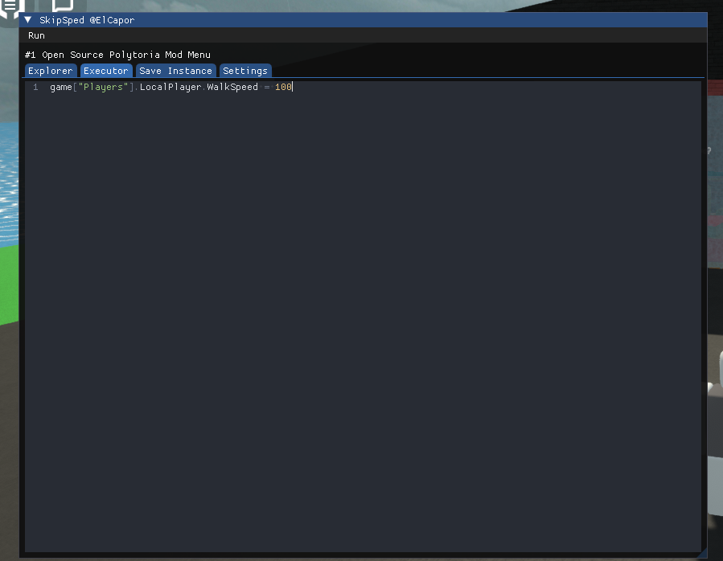
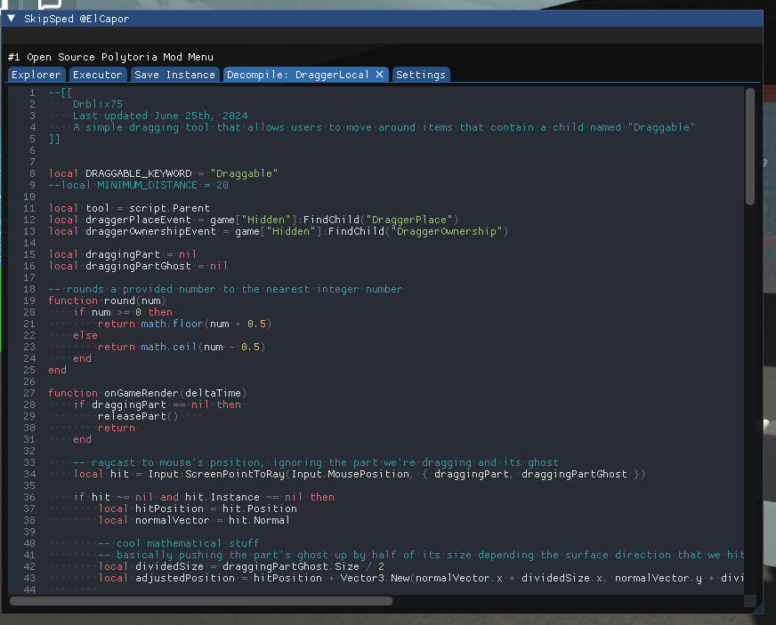
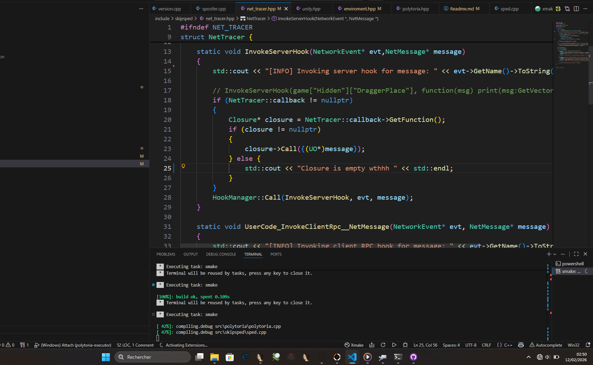

# POLHACK







# V2 : Added decompilation and explorer & save instance (doesnt work in solo mode !!)
# THE KEY TO OPEN OR CLOSE THE UI IS "DELETE"

#1 Open Source Polytoria Executor

Written by @ElCapor on github

Notice: I am open to any work opportunities, I am specialized in reverse engineering and protection systems.

Communicate with me and let's make your security better

# Tree

TBD

# Build

- Visual Studio 2022
- Download xmake from [https://xmake.Io](https://xmake.io)

### Download

#### Build from source

```sh
git clone https://github.com/ElCapor/polytoria-executor.git

cd polytoria-executor

xmake

Open PolyHack.sln in visual studio and press build

```

#### Download standalone dll
Download latest DLL from Github Actions

#### Download Pre-Built
[Polytoria.Executor.by.ElCapor.7z](https://github.com/ElCapor/polytoria-executor/blob/master/Release/Polytoria%20Executor%20by%20ElCapor.7z)


# Community (Warning: do not join on your main discord account, polytoria staff will ban you from their server)
https://discord.gg/vscvprztP3


# Special Mentions

- [1337Skid](https://github.com/1337Skid) - Here since day 0
- [NtReadVirtualMemory](https://github.com/NtReadVirtualMemory) - Contributed to the codebase + super good best friend fr
- [NASNCeria](https://github.com/NASCeria) - Also known as NASEC - **Reverse Engineered Il2Cpp Delegate System in detail + Custom functions**

<br>
<br>

# Thanks for everyone who supported the project, starred the github and those who wrote scripts

In no particular order (as far as my memory goes) - dprtq max aip medic farhat miiselfs icy Moon y1sn povlander eli

# Eternal disrespect to : 
- Polytoria staff
- Snitches
- curmen10

# Funky 3Am notes
- DynValue's Closure is cleared when another script is ran wowie
It's 3 am i am dead atp
